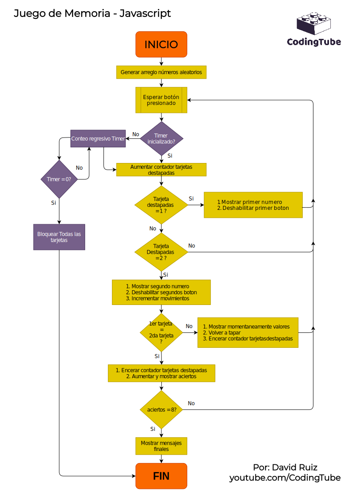

## Matching Game o juego de pares
---

Hola, en esta ocasión quise probar nuevas herramientas, este proyecto empezó como un aprendizaje y poco a poco se fue convirtiendo en una experiencia completa, lo cree porque necesito trabajar en mi memoria, así que, que mejor forma de hacerlo que creando un juego. 😁

Para su creación probé una nueva librería llamada underscore, que me da muchas funcionalidades que JavaScript debería tener, pero muchas veces no tiene. 

### Funcionamiento 

Agregue lógica booleana para que las tarjetas se muestren durante un determinado tiempo al usuario, junto a ello un contador regresivo que indica cuando se dejaran de mostrar estas tarjetas. 

Una vez concluido queda a la espera de que se elija una carta, cuando ya se ha elegido empezara un contador regresivo con el tiempo del juego, en este caso 60 segundos. Nivel fácil :) Ya solo queda unir los pares completos, cada acierto aumentará el marcador y cada movimiento.

Si son match aumenta el marcador de acierto y si no son las cartas se muestran por un breve periodo de tiempo y luego se ocultan.

El juego termina una vez haya llegado a cero el contador o se hayan completado todos los pares. Aparecerá un botón para repetir nuevamente, esto desordenara las cartas y empezara de nuevo.

### Tecnologías

+ HTML semantic tags
+ CSS
+ JavaScript
+ Underscore(Librería)

### Algoritmo

Esta fue mi guía durante toda la creación del proyecto. 

+ Este algoritmo es un recurso de [CodingTube](https://www.youtube.com/c/CodingTube)